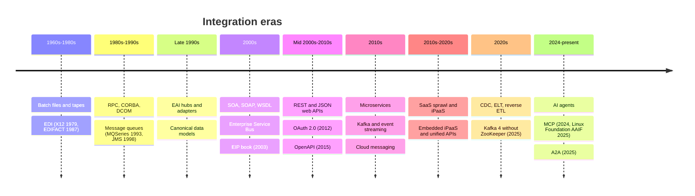

# A short history of integration

Used in [Chapter 2](../chapters/02-history.md).

```mermaid
timeline
  title Integration eras
  1960s-1980s : Batch files and tapes : EDI (X12 1979, EDIFACT 1987)
  1980s-1990s : RPC, CORBA, DCOM : Message queues (MQSeries 1993, JMS 1998)
  Late 1990s : EAI hubs and adapters : Canonical data models
  2000s : SOA, SOAP, WSDL : Enterprise Service Bus : EIP book (2003)
  Mid 2000s-2010s : REST and JSON web APIs : OAuth 2.0 (2012) : OpenAPI (2015)
  2010s : Microservices : Kafka and event streaming : Cloud messaging
  2010s-2020s : SaaS sprawl and iPaaS : Embedded iPaaS and unified APIs
  2020s : CDC, ELT, reverse ETL : Kafka 4 without ZooKeeper (2025)
  2024-present : AI agents : MCP (2024, Linux Foundation AAIF 2025) : A2A (2025)
```
