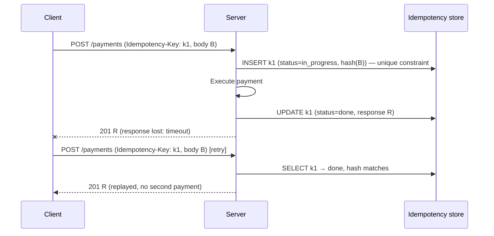

# Idempotency key: retry after a lost response

The server claims the key before doing the work, then replays the stored response on retry.

Used in [Chapter 8](../chapters/08-reliability.md).

```mermaid
sequenceDiagram
  participant C as Client
  participant S as Server
  participant K as Idempotency store
  C->>S: POST /payments (Idempotency-Key: k1, body B)
  S->>K: INSERT k1 (status=in_progress, hash(B)) — unique constraint
  S->>S: Execute payment
  S->>K: UPDATE k1 (status=done, response R)
  S--xC: 201 R (response lost: timeout)
  C->>S: POST /payments (Idempotency-Key: k1, body B)  [retry]
  S->>K: SELECT k1 → done, hash matches
  S-->>C: 201 R (replayed, no second payment)
```
