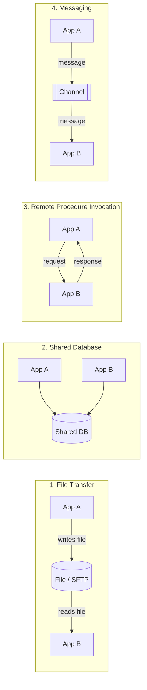

# The four integration styles

File transfer, shared database, remote procedure invocation and messaging (Hohpe and Woolf).

Used in [Chapter 5](../chapters/05-integration-styles-and-patterns.md).

