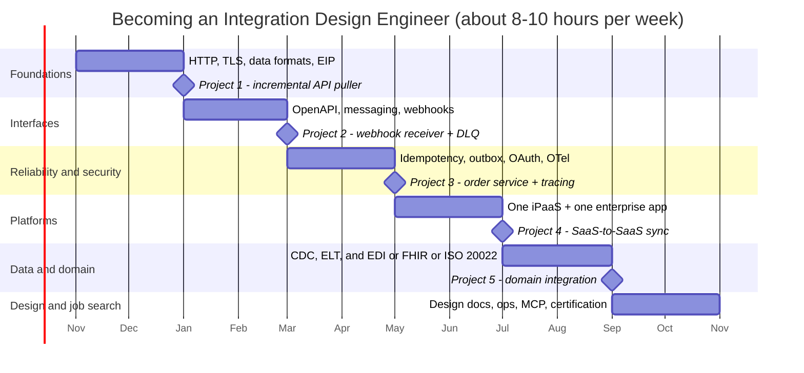

# 12-month learning roadmap

Used in [Chapter 19](../chapters/19-career.md).

```mermaid
gantt
  title Becoming an Integration Design Engineer (about 8-10 hours per week)
  dateFormat YYYY-MM
  axisFormat %b
  section Foundations
  HTTP, TLS, data formats, EIP          :a1, 2026-11, 2M
  Project 1 - incremental API puller    :milestone, after a1, 0d
  section Interfaces
  OpenAPI, messaging, webhooks          :a2, after a1, 2M
  Project 2 - webhook receiver + DLQ    :milestone, after a2, 0d
  section Reliability and security
  Idempotency, outbox, OAuth, OTel      :a3, after a2, 2M
  Project 3 - order service + tracing   :milestone, after a3, 0d
  section Platforms
  One iPaaS + one enterprise app        :a4, after a3, 2M
  Project 4 - SaaS-to-SaaS sync         :milestone, after a4, 0d
  section Data and domain
  CDC, ELT, and EDI or FHIR or ISO 20022 :a5, after a4, 2M
  Project 5 - domain integration        :milestone, after a5, 0d
  section Design and job search
  Design docs, ops, MCP, certification  :a6, after a5, 2M
```
