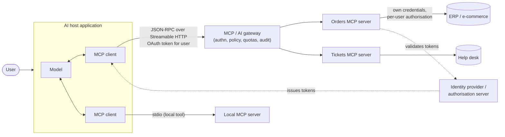

# MCP architecture for an enterprise

Hosts contain MCP clients; each client talks to one MCP server; servers call systems of record with their own credentials (no token passthrough).

Used in [Chapter 18](../chapters/18-ai-and-the-future.md).

