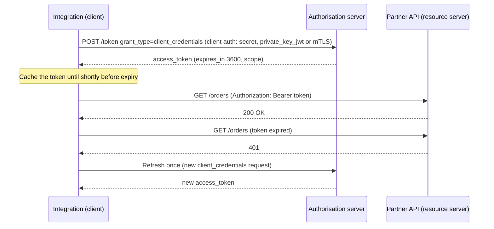
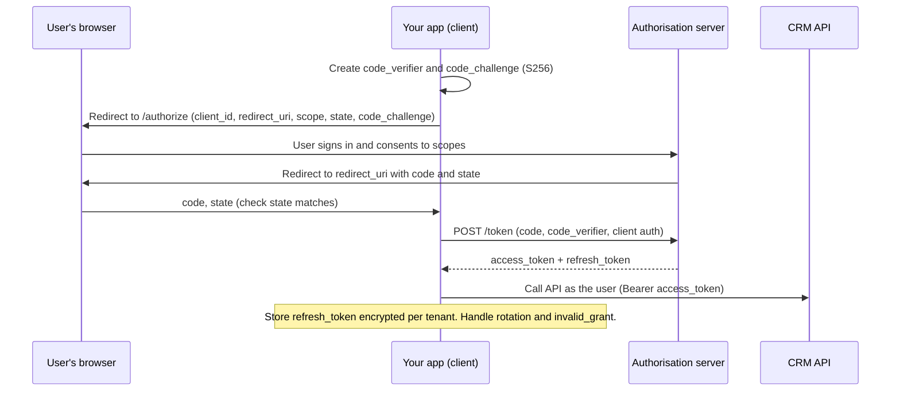

# OAuth 2.0 / 2.1 flows used in integrations

Used in [Chapter 10](../chapters/10-security.md).

## Client credentials (server-to-server)

## Authorisation code + PKCE (user-delegated, e.g. "Connect your CRM")

