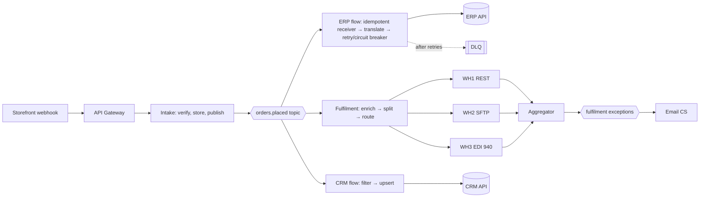

# Worked example: order flow in EIP terms

Intake, publish-subscribe fan-out, idempotent receivers, splitter, router, aggregator and dead-letter channel.

Used in [Chapter 5](../chapters/05-integration-styles-and-patterns.md).

