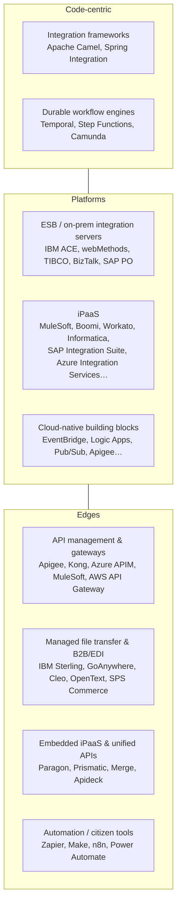

# Integration technology landscape

Code-centric tools, platforms and edge categories.

Used in [Chapter 11](../chapters/11-platforms.md).

```mermaid
flowchart TB
  subgraph Code["Code-centric"]
    FW["Integration frameworks<br/>Apache Camel, Spring Integration"]
    WF["Durable workflow engines<br/>Temporal, Step Functions, Camunda"]
  end
  subgraph Platforms["Platforms"]
    ESB["ESB / on-prem integration servers<br/>IBM ACE, webMethods, TIBCO, BizTalk, SAP PO"]
    IPAAS["iPaaS<br/>MuleSoft, Boomi, Workato, Informatica,<br/>SAP Integration Suite, Azure Integration Services…"]
    CLOUD["Cloud-native building blocks<br/>EventBridge, Logic Apps, Pub/Sub, Apigee…"]
  end
  subgraph Edges["Edges"]
    APIM["API management & gateways<br/>Apigee, Kong, Azure APIM, MuleSoft, AWS API Gateway"]
    MFT["Managed file transfer & B2B/EDI<br/>IBM Sterling, GoAnywhere, Cleo, OpenText, SPS Commerce"]
    EMB["Embedded iPaaS & unified APIs<br/>Paragon, Prismatic, Merge, Apideck"]
    AUTO["Automation / citizen tools<br/>Zapier, Make, n8n, Power Automate"]
  end
  Code --- Platforms --- Edges
```
