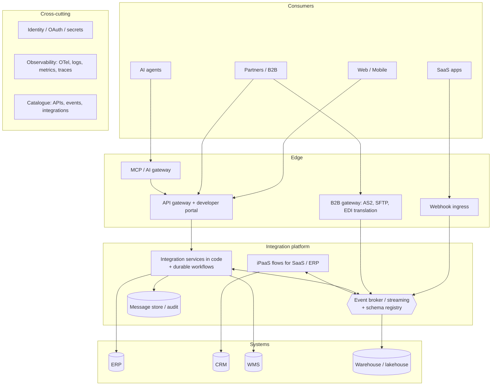

# Reference architecture: a modern integration estate

Edge, core platform, systems of record and cross-cutting concerns.

Used in [Chapter 17](../chapters/17-architecture-and-governance.md).

```mermaid
flowchart TB
  subgraph Consumers
    Web["Web / Mobile"]
    Partners["Partners / B2B"]
    Agents["AI agents"]
    SaaS["SaaS apps"]
  end
  subgraph Edge
    GW["API gateway + developer portal"]
    MCPGW["MCP / AI gateway"]
    B2B["B2B gateway: AS2, SFTP, EDI translation"]
    WHK["Webhook ingress"]
  end
  subgraph Core["Integration platform"]
    IPaaS["iPaaS flows for SaaS / ERP"]
    SVC["Integration services in code<br/>+ durable workflows"]
    BROKER{{Event broker / streaming<br/>+ schema registry}}
    STORE[(Message store / audit)]
  end
  subgraph Systems
    ERP[(ERP)]
    CRM[(CRM)]
    WMS[(WMS)]
    DW[(Warehouse / lakehouse)]
  end
  subgraph CrossCutting["Cross-cutting"]
    IAM["Identity / OAuth / secrets"]
    OBS["Observability: OTel, logs, metrics, traces"]
    CAT["Catalogue: APIs, events, integrations"]
  end
  Web --> GW
  Partners --> GW
  Partners --> B2B
  Agents --> MCPGW --> GW
  SaaS --> WHK
  GW --> SVC
  WHK --> BROKER
  B2B --> BROKER
  SVC <--> BROKER
  IPaaS <--> BROKER
  SVC --> ERP
  IPaaS --> CRM
  SVC --> WMS
  BROKER --> DW
  SVC --> STORE
```
