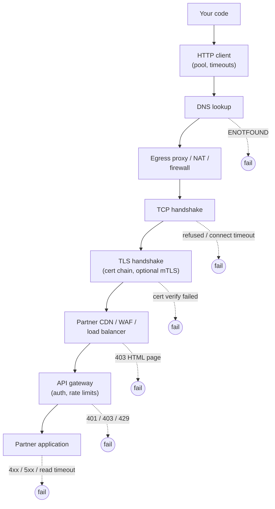

# The journey of an HTTPS request

Every hop is a place an integration can fail, and each failure has its own error signature.

Used in [Chapter 3](../chapters/03-networks-and-http.md).

```mermaid
flowchart TB
  C["Your code"] --> P["HTTP client<br/>(pool, timeouts)"]
  P --> D["DNS lookup"]
  D --> E["Egress proxy / NAT /<br/>firewall"]
  E --> T["TCP handshake"]
  T --> S["TLS handshake<br/>(cert chain, optional mTLS)"]
  S --> W["Partner CDN / WAF /<br/>load balancer"]
  W --> G["API gateway<br/>(auth, rate limits)"]
  G --> A["Partner application"]
  D -. "ENOTFOUND" .-> X1(("fail"))
  T -. "refused / connect timeout" .-> X2(("fail"))
  S -. "cert verify failed" .-> X3(("fail"))
  W -. "403 HTML page" .-> X4(("fail"))
  G -. "401 / 403 / 429" .-> X5(("fail"))
  A -. "4xx / 5xx / read timeout" .-> X6(("fail"))
```
