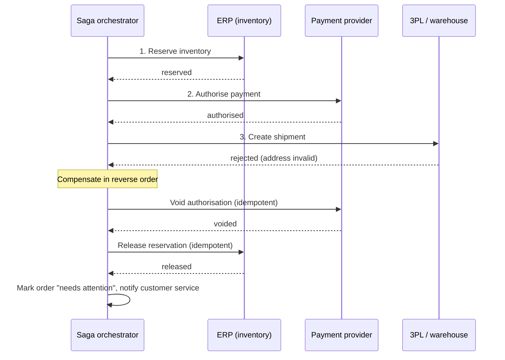

# Orchestrated saga with compensations

Step 3 fails, so the orchestrator compensates steps 2 and 1 in reverse order.

Used in [Chapter 8](../chapters/08-reliability.md).

```mermaid
sequenceDiagram
  participant O as Saga orchestrator
  participant ERP as ERP (inventory)
  participant PSP as Payment provider
  participant WMS as 3PL / warehouse
  O->>ERP: 1. Reserve inventory
  ERP-->>O: reserved
  O->>PSP: 2. Authorise payment
  PSP-->>O: authorised
  O->>WMS: 3. Create shipment
  WMS-->>O: rejected (address invalid)
  Note over O: Compensate in reverse order
  O->>PSP: Void authorisation (idempotent)
  PSP-->>O: voided
  O->>ERP: Release reservation (idempotent)
  ERP-->>O: released
  O->>O: Mark order "needs attention", notify customer service
```
