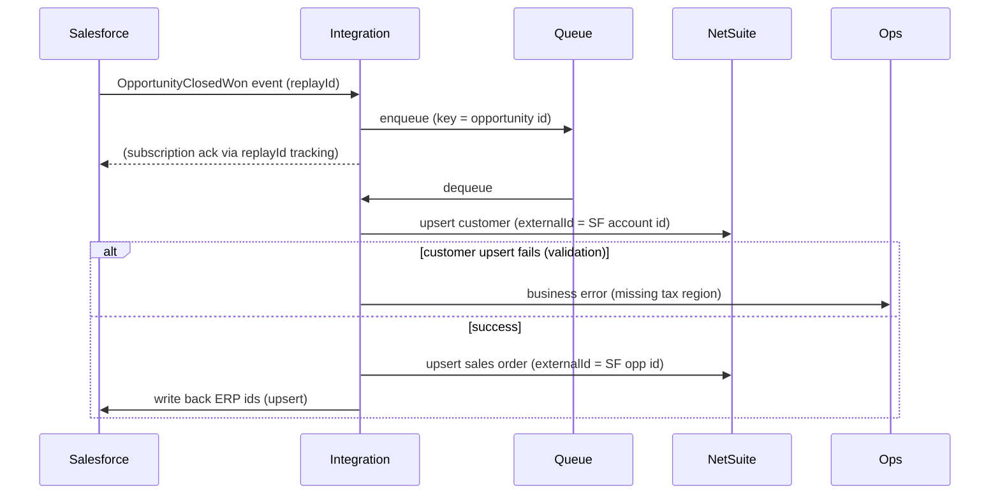

# Sequence diagram with failure path

Salesforce Closed Won to NetSuite, including the business-error branch.

Used in [Chapter 14](../chapters/14-design-process.md).

```mermaid
sequenceDiagram
  participant SF as Salesforce
  participant INT as Integration
  participant Q as Queue
  participant ERP as NetSuite
  SF->>INT: OpportunityClosedWon event (replayId)
  INT->>Q: enqueue (key = opportunity id)
  INT-->>SF: (subscription ack via replayId tracking)
  Q->>INT: dequeue
  INT->>ERP: upsert customer (externalId = SF account id)
  alt customer upsert fails (validation)
    INT->>Ops: business error (missing tax region)
  else success
    INT->>ERP: upsert sales order (externalId = SF opp id)
    INT->>SF: write back ERP ids (upsert)
  end
```
