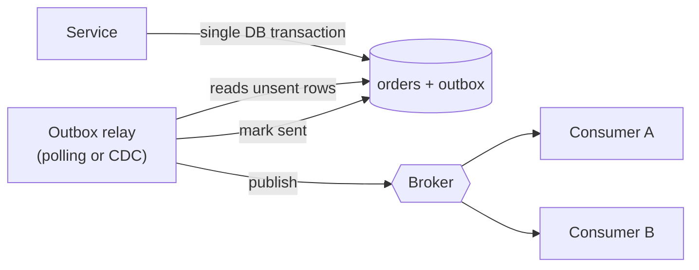

# Transactional outbox

Business change and event are written in one database transaction; a relay publishes the event.

Used in [Chapter 8](../chapters/08-reliability.md).

```mermaid
flowchart LR
  APP["Service"] -- single DB transaction --> DB[(orders + outbox)]
  RELAY["Outbox relay<br/>(polling or CDC)"] -- reads unsent rows --> DB
  RELAY -- publish --> BR{{Broker}}
  RELAY -- mark sent --> DB
  BR --> C1["Consumer A"]
  BR --> C2["Consumer B"]
```
