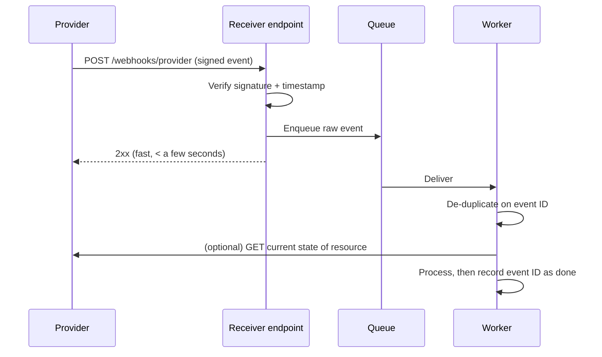

# Consuming webhooks safely

Verify, enqueue, acknowledge fast, then de-duplicate and process asynchronously.

Used in [Chapter 7](../chapters/07-async-and-events.md).

```mermaid
sequenceDiagram
  participant P as Provider
  participant R as Receiver endpoint
  participant Q as Queue
  participant W as Worker
  P->>R: POST /webhooks/provider (signed event)
  R->>R: Verify signature + timestamp
  R->>Q: Enqueue raw event
  R-->>P: 2xx (fast, < a few seconds)
  Q->>W: Deliver
  W->>W: De-duplicate on event ID
  W->>P: (optional) GET current state of resource
  W->>W: Process, then record event ID as done
```
