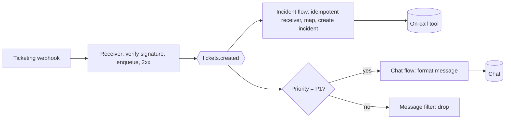

# Exercises: Chapter 5, Integration Styles and Patterns

## Questions

1. Choose an integration style for each and justify it: (a) a credit check during checkout; (b) nightly payroll export to a bank; (c) notifying five systems when a customer changes address; (d) a reporting tool needing read access to an on-premises ERP; (e) a partner that only supports SFTP.
2. Name the EIP pattern: (a) "Only forward orders for the EU region to the EU warehouse." (b) "Split a purchase order into one message per line." (c) "Wait until all three carriers reply, or 10 seconds pass, then pick the cheapest." (d) "Store the 40 MB PDF in object storage and send a link." (e) "Copy every message to an audit topic." (f) "Ignore duplicates of the same message."
3. What three things must an Aggregator define?
4. Describe an orchestration and a choreography design for "order placed → reserve stock → charge card → ship". Which would you choose for a single team owning all three steps, and which for three teams in different departments?
5. Identify the antipattern: "Every night, a stored procedure in the e-commerce database inserts rows directly into the ERP's `SALES_ORDER` table."
6. Draw (in Mermaid) a design for: webhook from a SaaS ticketing tool → create an incident in the on-call tool, and post a message in chat for P1 tickets only.

## Solutions

1. (a) Synchronous API: the decision is needed now. (b) File transfer: batch, bank standard, auditable. (c) Messaging with publish-subscribe: fan-out, decoupled. (d) Read-only replica, CDC or an API; avoid direct queries on the live ERP database. (e) File transfer.
2. (a) Content-Based Router (or Message Filter per channel); (b) Splitter; (c) Scatter-Gather (Recipient List + Aggregator with timeout); (d) Claim Check; (e) Wire Tap; (f) Idempotent Receiver.
3. Correlation (which messages belong together), completeness condition (count, timeout, end marker), and aggregation strategy (how to combine).
4. Orchestration: a workflow engine calls the stock, payment and shipping services in turn and runs compensations on failure. Choreography: the order service emits OrderPlaced; stock reserves and emits StockReserved; payment charges and emits PaymentCaptured; shipping ships. Single team: orchestration (visibility, simpler failure handling). Three departments: choreography across domains with events as contracts, possibly with orchestration inside each domain.
5. Integration (shared) database antipattern: bypasses ERP business logic, couples to its schema, unsupported. Use the ERP's API or import mechanism.
6. Example:

