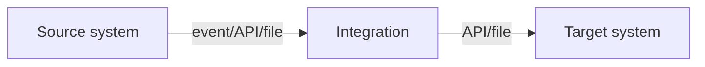

# Integration Design Document: <Integration name>

| | |
|---|---|
| **Status** | Draft / In review / Approved / Superseded |
| **Version** | 0.1 |
| **Author(s)** | |
| **Reviewers** | System owners, security, operations, peer engineer |
| **Sponsor** | |
| **Last updated** | YYYY-MM-DD |
| **Criticality tier** | 1 (business-critical) / 2 / 3 |

## 1. Summary

*One paragraph: business event → outcome → timeliness → value → current state (Chapter 14 §14.2).*

**Decision summary:** *Style and platform chosen, in one or two sentences, linking to ADRs.*

## 2. Context

### 2.1 Context diagram

### 2.2 Systems

| System | Role (source/target) | Owner (team, contact) | Environments (dev/test/prod instance) | Interface used | Docs |
|---|---|---|---|---|---|

### 2.3 In scope / out of scope

## 3. Scenarios (functional requirements)

| ID | Scenario | Trigger | Expected outcome | Notes |
|---|---|---|---|---|
| F-01 | | | | |

## 4. Non-functional requirements

| Category | Requirement (measurable) | Source / rationale |
|---|---|---|
| Volume | Avg … / peak … per … ; backfill … records | |
| Latency / freshness | 95% within … ; 100% within … | |
| Availability & outage behaviour | | |
| Ordering | Per … key / not required | |
| Consistency & reconciliation | | |
| Security & data classification | | |
| Compliance & audit | | |
| Observability | | |
| Recoverability (replay window) | | |
| Supportability | | |
| Cost / limits budget | | |

## 5. Architecture

### 5.1 Style and patterns

*Name them in EIP terms (Chapter 5), e.g. "Event Message via Publish-Subscribe Channel; Idempotent Receiver; Content Enricher; Dead Letter Channel; Transactional Outbox".*

### 5.2 Options considered

| Option | Pros | Cons | Verdict |
|---|---|---|---|

### 5.3 Component / container diagram

### 5.4 Sequence diagrams (one per scenario, **including failure paths**)

## 6. Interfaces and contracts

| Interface | Direction | Protocol / style | Contract (OpenAPI/AsyncAPI/file spec link) | Auth | Version | Limits |
|---|---|---|---|---|---|---|

## 7. Data

- **Mapping specification:** *link*
- **Key / identity strategy:** *external IDs, upsert keys, cross-reference*
- **System of record per entity / field:**
- **Value maps:** *link; who maintains them*
- **Conflict rules (if bidirectional):**
- **Deletes, merges, cancellations:**

## 8. Error handling and reliability

### 8.1 Error classification

| Error | Example | Class (retry / fix-then-retry / permanent / business) | Handling | Who is notified |
|---|---|---|---|---|

### 8.2 Mechanisms

- Timeouts: connect … / read … / total …
- Retries: attempts … , backoff … , layer …
- Idempotency: key … , store … , retention …
- Circuit breaker / consumer pause:
- DLQ and business error queue:
- Replay capability (window, tooling):
- Dual-write avoidance (outbox / workflow engine):
- Saga / compensations (if multi-step):
- Reconciliation (what, how often, tolerance, owner):
- Backfill isolation (bulkheads):

## 9. Security and compliance

| Topic | Design |
|---|---|
| Data categories (PII, PHI, PCI, financial) | |
| Authentication per interface | |
| Authorisation / scopes / integration users | |
| Secrets storage and rotation | |
| Encryption in transit / at rest / message-level | |
| Data minimisation | |
| Logging and redaction | |
| Data residency / regions | |
| Vendor agreements (DPA, BAA) | |
| Retention of copies (logs, DLQs, message store) | |

### 9.1 Threat model (STRIDE at each trust boundary)

| Boundary | Threat | Mitigation |
|---|---|---|

## 10. Observability and operations

- Metrics and dashboards:
- Business signals (volume, freshness, completeness):
- Alerts (condition → severity → recipient):
- Tracing (propagation through each hop):
- SLOs:
- Runbook: *link*

## 11. Deployment

- Environments matrix:
- Configuration and secrets:
- CI/CD and infrastructure as code:
- Cut-over and backfill plan:
- Feature flags / gradual rollout:
- Rollback plan:

## 12. Testing strategy

| Level | Scope | Tools | Owner | When |
|---|---|---|---|---|

## 13. Risks, assumptions, open questions

| Type | Description | Owner | Due | Status |
|---|---|---|---|---|

## 14. Decisions

- ADR-001: …

## 15. Appendices

- Sample payloads (source and target), edge cases
- Glossary
